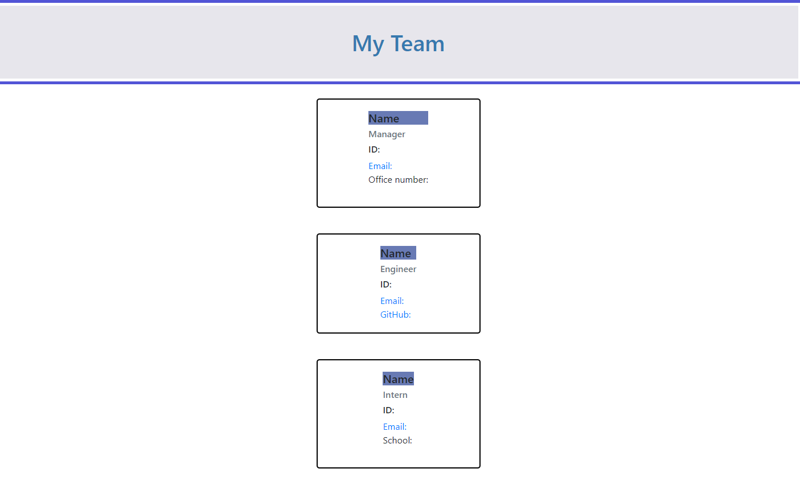

# Team-Profile-Generator

## Objective: 

    Build a Node.js command-line application that takes in information about employees on a software engineering team. Also generate an HTML webpage that displays summaries for each person. Also a unit test will run every code and ensure that it passes each test.

## Details:

* WHEN I start the application. I'm prompted to enter the team manager's name, employee ID, 
email address, and office number. Then when all is entered I'm presented with an option to add an engineer or an intern or to finish building my team. 

* When I select Engineer option. Then I'm prompted to enter the Engineer's name, ID, email and a GitHub Username. When all is entered then I'm given an option to enter another team member (Y/N)

* When I select the Intern option. Then I'm prompted to enter the intern's name, ID, email, and school. When all is entered then I'm give the option to continue (Y/N). 

* When I decide to finish building my team.  Then I exit the application, and the HTML is generated.

---

